# PROJECT UBICOM

## APLIKASI PREDIKSI WAKTU KEDATANGAN BUS DAN PELACAKAN POSISI BUS

### Latar belakang

Transportasi umum memainkan peran penting dalam mobilitas perkotaan dan konektivitas masyarakat. Bus menjadi salah satu sarana transportasi umum yang cukup banyak digunakan oleh masyarakat. Salah satu manfaat penggunaan bus ini adalah untuk mengurangi masalah kemacetan, namun masih banyak masyarakat yang lebih memilih menggunakan kendaraan pribadi dibanding kendaraan umum, dan salah satu alasannya yaitu masalah kenyamanan.

Salah satu penyebab ketidaknyamanan dalam menggunakan bus adalah terkait ketidakpastian jadwal keberangkatan bus. Terkadang bus tidak berangkat tepat waktu sesuai jadwal keberangkatan yang ada, hal ini mengakibatkan penumpang tertinggal bus maupun menunggu bus terlalu lama tanpa kepastian. 

Untuk mengatasi masalah tersebut dibutuhkan suatu sistem yang dapat melakukan prediksi waktu kedatangan bus dan pelacakan posisi bus, agar penumpang bisa tahu keberadaan bus yang ditujunya sudah sampai mana, sudah berangkat ataukah belum, dan sampai halte jam berapa. Sehingga penumpang tidak perlu khawatir akan ketinggalan bus, karena aplikasi akan memberi informasi posisi bus dan memberikan estimasi kedatangan bus kepada penumpang.

Aplikasi prediksi waktu kedatangan bus dan pelacakan posisi bus ini mampu melakukan pelacakan posisi bus dengan memanfaatkan teknologi GPS yang terintegrasi dalam perangkat telepon pintar, melaporkan posisi bus, sehingga pengguna dapat memantau secara langsung dimana posisi bus berada, dan juga memberikan estimasi waktu berapa lama lagi bus akan tiba di lokasi tempat pengguna menunggu bus.

Aplikasi yang dibangun terdiri dari 2 versi yang berbeda, yaitu versi sopir dan penumpang. Aplikasi versi sopir digunakan oleh pihak operasional bus untuk mengirimkan data lokasi terkini bus ke server, sedangkan aplikasi versi penumpang digunakna oleh penumpang untuk memantau posisi bus dan melihat prediksi waktu kedatangan bus

### Branding

Merek: GObus

Inspirasi merek: Kata "Go" adalah kata kerja yang kuat dan positif. Ini memberi kesan bahwa pengguna akan "pergi" atau "bergerak" dengan bantuan aplikasi ini. Gobus merepresentasikan pengguna yang akan pergi dengan menggunakan bus, selain itu Gobus juga bermakna ajakan kepada pengguna untuk menggunakan bus sebagai kendaraan umum, demi mengurangi kemacetan yang kerap kali menjadi masalah terutama di perkotaan.

Tagline: The Smart Public Transportation. Take Public Transportation Without Worry.

Campaign: Memberikan kemudahan dalam menggunakan kendaraan umum, naik bus tanpa khawatir ketinggalan dan lelahnya menunggu dalam ketidakpastian.

Target user: usia 10+, pengguna kendaraan umum

User experience theme: informatif dan mudah digunakan, optimal, memberikan informasi seakurat mungkin

### User Story

| sebagai | Saya ingin bisa                                           | sehingga                                                      | prioritas  |
| ------- | --------------------------------------------------------- | ------------------------------------------------------------- | ---------- |
| sistem  | Mengirim lokasi terkini bus                               | Bisa membaca titik koordinat                                  | ⭐⭐⭐⭐⭐ |
| sistem  | Menampilkan posisi bus di peta                            | Bisa menempatkan koordinat di peta dengan akurat              | ⭐⭐⭐⭐⭐ |
| sistem  | Melakukan tracking secara realtime terhadap posisi bus    | Bisa memperbarui titik koordinat bus secara berkala           | ⭐⭐⭐⭐⭐ |
| sistem  | Melakukan pemesanan tiket online                          | Bisa melakukan transaksi pembelian tiket di aplikasi          | ⭐⭐⭐⭐ |
| sistem  | Menampilkan posisi bus yang dekat dengan pengguna         | Bisa membaca titik koordinat lebih dari 1 bus                 | ⭐⭐⭐      |
| sistem  | Memperkirakan waktu kedatangan bus kepada pengguna        | Bisa menghitung estimasi waktu terhadap jarak yang ditempuh bus untuk sampai ke pengguna | ⭐⭐⭐⭐⭐ |

### Metode dan algoritma

Sensor:

- GPS: GPS built-in di perangkat android.
  Mobile software development: prototype

### Struktur data

### Arsitektur sistem

Aplikasi versi sopir (aplikasi yang ditujuakan untuk digunakan pihak bus) akan mengaktifkan sensor GPS yang tersedia di perangkat telepon pintar dan difungsikan sebagai pengirim data posisi terkini bus, aplikasi akan tetap berjalan dilatar belakang agar tetap senantiasa mengirimkan data posisi terkini tanpa terputus. Data posisi bus akan ditangani menggunakan protokol komunikasi MQTT yang selanjutnya akan dikirim ke server. Aplikasi versi penumpang (aplikasi yang ditujukan untuk calon penumpang bus) akan mengambil data lokasi terkini bus yang ada di server dan menampilkannya dalam maps agar pengguna dapat mengetahui posisi bus, kemudian dari data yang telah diolah menggunakan algoritma machine learning, pengguna akan mendapatkan prediksi atau estimasi waktu kedatangan bus.

### Deskripsi teknologi

Mesin komputasi:

- Cloud Server: Google Cloud Dataflow, untuk mengelola aliran data secara realtime dan mengolah serta menganalisis data yang diterima dari perangkat IoT.
- Smartphone: Android, karena Android merupakan smartphone yang umum dan banyak digunakan oleh mayoritas orang saat ini.
  Software development:
- Mobile Developmnet: Flutter, Flutter dipilih karena kemampuannya dalam pengembangan cross-platform, antarmuka pengguna yang kaya, kinerja tinggi, fitur Hot Reload, dukungan komunitas yang kuat, dan sifat open source-nya.
- Backend Development: Express.js, karena Express.js adalah salah satu library backend yang cukup terkenal dan banyak digunakan oleh backend developer.
  Sensor:
- GPS: GPS built-in smartphone, alasan penggunaan GPS built-in adalah untuk menekan pengeluaran membeli perangkat IoT, lebih sederhana, dan mudah dalam pemeliharaan, karena hanya berupa software.

### User Experience (UX) Design

| No | Tindakan pengguna | Tampilan Aplikasi |
| --- | --- | --- |
| 1 | Pertama kali membuka aplikasi | 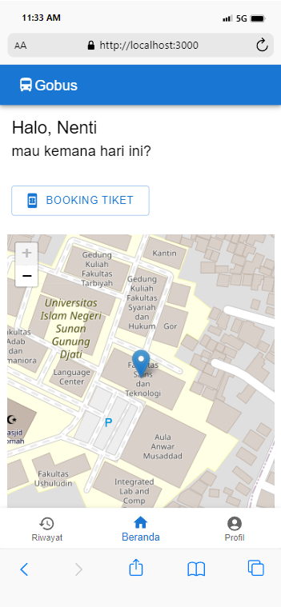 |
| 2 | Klik pada tombol "BOOKING TIKET" (sebelum login | 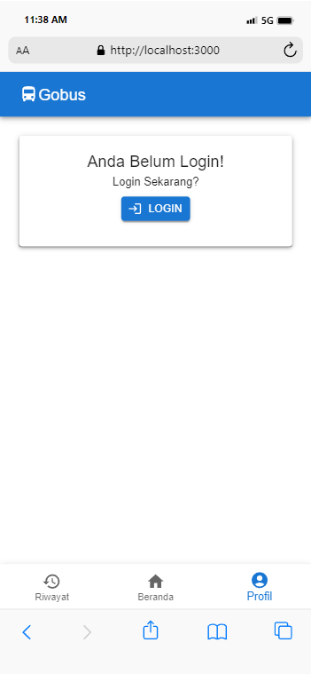 |
| 3 | Klik pada tombol "LOGIN" | 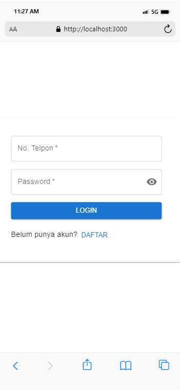 |
| 4 | Klik pada tombol "DAFTAR" | 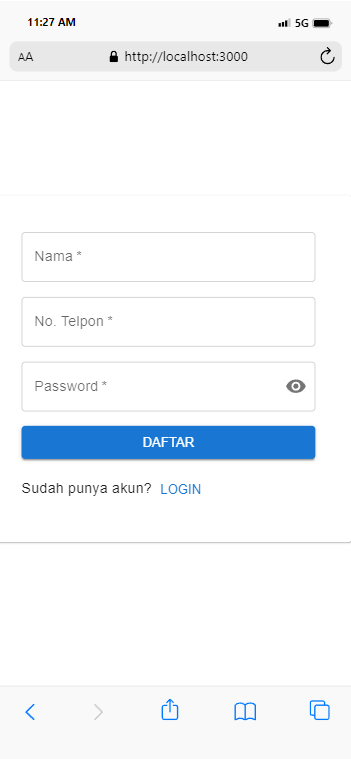 |
| 5 | Berhasil mendaftar | 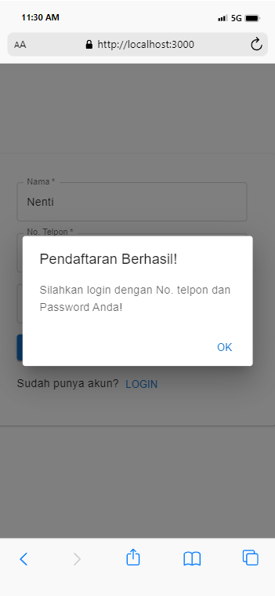 |
| 6 | Klik pada tombol "OK " / "LOGIN" |  |
| 7 | Berhasil login |  |
| 8 | Klik pada tombol "BOOKING TIKET" | 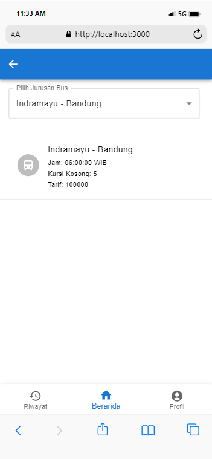 |
| 9 | Klik pada salah satu jurusan bus | 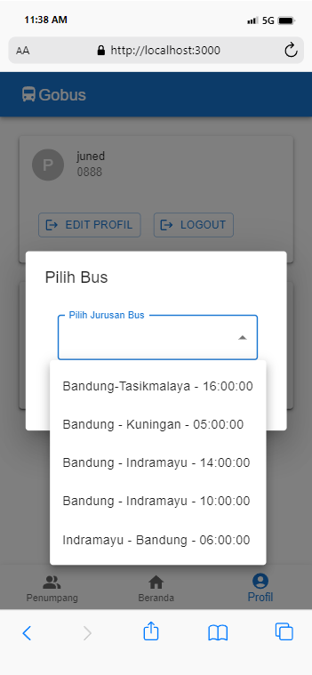 |
| 10 | Klik pada salah satu pilihan bus | 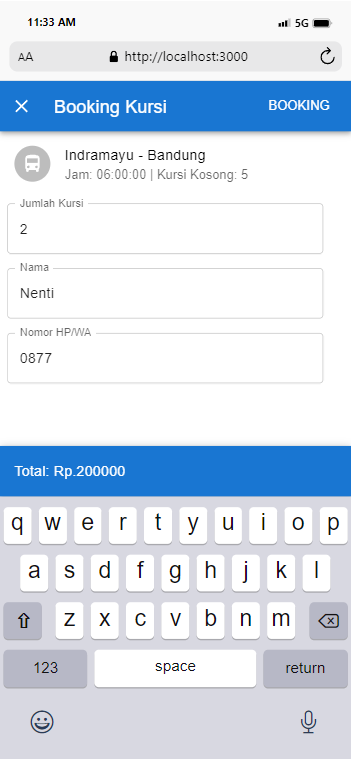 |
| 11 | klik pada tombol "BOOKING" | 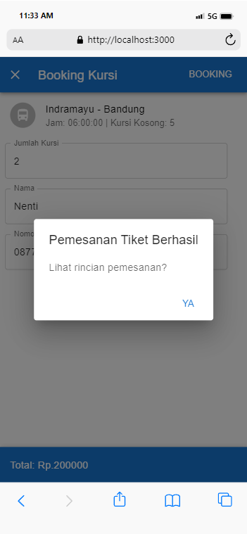 |
| 12 | Klik tombol "YA" | 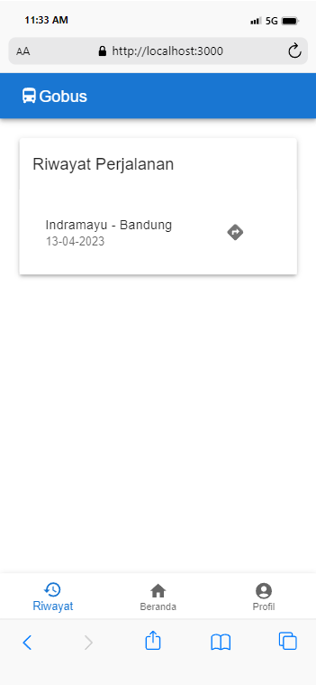 |
| 13 | Klik Riwayat pesanan teratas | 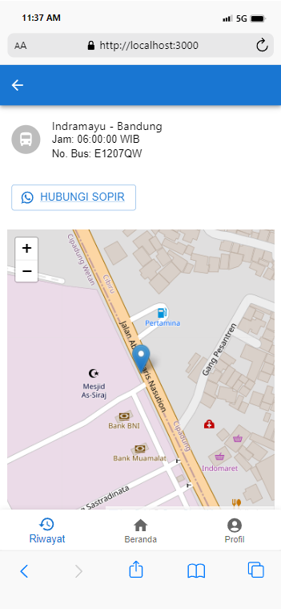 |
| 14 | Klik pada tombol "HUBUNGI SOPIR" | Redirect ke Whatsapp |
| 15 | Klik ikon riwayat |  |
| 16 | Klik ikon profil | 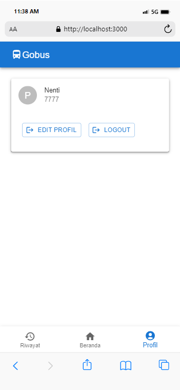 |
| 17 | Klik tombol "LOGOUT" | 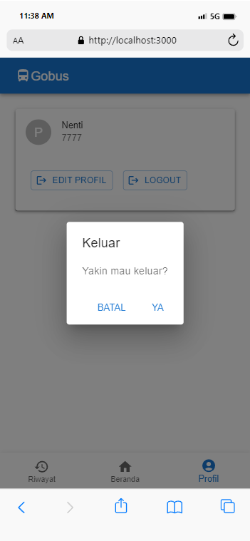 |
