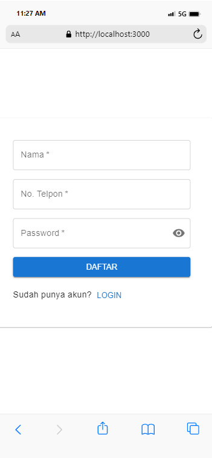
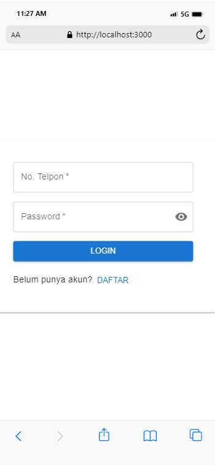
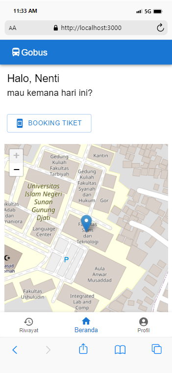
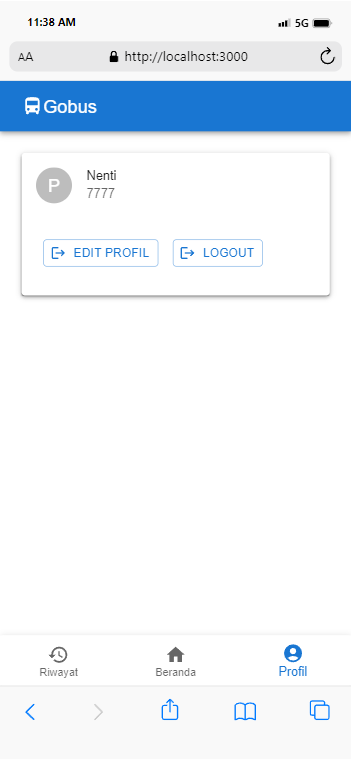
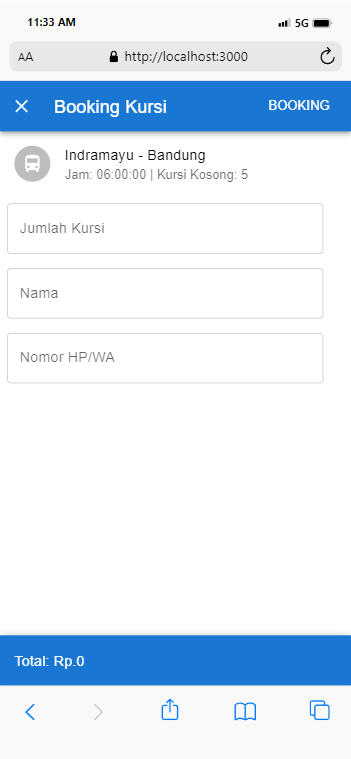
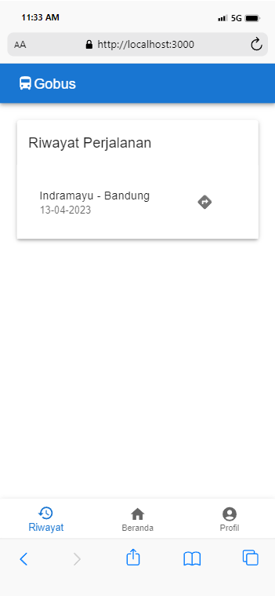
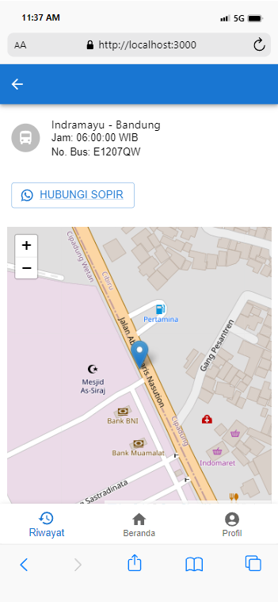

# PROJECT UBICOM 
## APLIKASI TRACKING BUS REALTIME DENGAN GPS 
### Latar belakang
Transportasi umum, memainkan peran penting dalam mobilitas perkotaan dan konektivitas masyarakat. Bus  menjadi salah satu sarana transportasi umum yang cukup banyak digunakan oleh masyarakat. 

Salah satu tantangan dalam menggunakan transportasi umum, terutama bus adalah terkait ketidakpastian jadwal keberangkatan bus. Seringkali pengguna ketinggalan bus, maupun kehabisan tempat duduk yang mengakibatkan ketidaknyamanan dari sisi penumpang. Untuk mengatasi masalah tersebut dibutuhkan suatu aplikasi yang dapat melakukan pelacakan posisi bus, agar pengguna tahu keberadaan bus sudah sampai mana. Sehingga penumpang tidak perlu khawatir akan ketinggalan bus, karena aplikasi akan memperkirakan bus akan sampai ke halte pukul berapa, dan pengguna juga bisa tahu bus sudah sampai mana.

Aplikasi tracking bus realtime dengan GPS (Global Positioning System) ini mampu melakukan pelacakan posisi bus dengan memanfaatkan GPS yang integrasikan di dalam bus dan sistem IoT (Internet of Things) untuk melaporkan posisi bus, sehingga pengguna dapat memantau secara langsung dimana posisi bus berada.

### Branding
Merek: GObus

Inspirasi merek: Terinspirasi dari salah satu startup besar indonesia yang bergerak di bidang transportasi, yang selalu menambahkan kata “go” di setiap fitur-fitur yang ditawarkannya.

Tagline: The Smart Public Transportation, Take Public Transportation Without Worry.

Campaign: Memberikan kemudahan dalam menggunakan kendaraan umum, tanpa khawatir ketinggalan, kepenuhan, dan kesulitan dalam pembayaran.

Target user: usia 10+

User experience theme: informatif dan mudah digunakan

### User Story
|sebagai |	Saya ingin bisa	| sehingga |	prioritas |
|---|---|---|---|
sistem | Mengirim lokasi terkini bus | Bisa membaca titik koordinat |	⭐⭐⭐⭐⭐ |
sistem | Menampilkan posisi bus di peta	| Bisa menempatkan koordinat di peta dengan akurat | ⭐⭐⭐⭐⭐ |
sistem | Melakukan tracking secara realtime terhadap posisi bus	| Bisa memperbarui titik koordinat bus secara berkala	| ⭐⭐⭐⭐⭐ |
sistem | Melakukan pemesanan tiket online	| Bisa melakukan transaksi pembelian tiket di aplikasi | ⭐⭐⭐⭐⭐ |
sistem | Menampilkan posisi bus yang dekat dengan pengguna | Bisa membaca titik koordinat lebih dari 1 bus | ⭐⭐⭐⭐ |
sistem | Menampilkan peta tempat duduk yang masih kosong dalam bus | Bisa menampilkan kursi yang belum dipesan oleh penumpang lain | ⭐⭐⭐ |

### Metode dan algoritma
Sensor: 
-	GPS: Modul GPS UBlox NEO-6M. Penjelasan: Modul GPS ini cukup populer dan mudah digunakan serta menyediakan data posisi yang akurat dan dapat diintegrasikan dengan mikrokontroler seperti Arduino.
Mobile software development: waterfall
Edge software development: waterfall

### Struktur data

### Arsitektur sistem

### Deskripsi teknologi
Mesin komputasi:
-	Edge Server: Arduino. Penjelasan: Karena Arduino adalah mikrokontroller yang sederhana dan mudah dioperasikan serta memiliki dukungan komunitas yang cukup besar
-	Cloud Server: GCP 
-	Smartphone: Android & iPhone. Penjelasan: Android & iPhone merupakan smartphone yang umum dan banyak digunakan saat ini.
Software development:
-	PWA/Front-end Developmnet: React.js. Penjelasan: React.js merupakan library javascript yang umum digunakan dalam pembangunan aplikasi web maupun mobile.
-	Backend Development: Flask. Penjelasan: Flask merupakan framework python yang biasa digunakan untuk web.
Sensor: 
-	GPS: Modul GPS UBlox NEO-6M. Penjelasan: Modul GPS ini cukup populer dan mudah digunakan serta menyediakan data posisi yang akurat dan dapat diintegrasikan dengan mikrokontroler seperti Arduino

### User Experience (UX) Design

